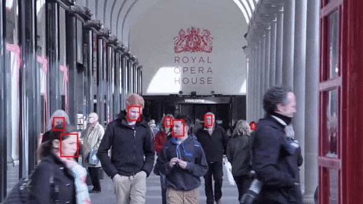
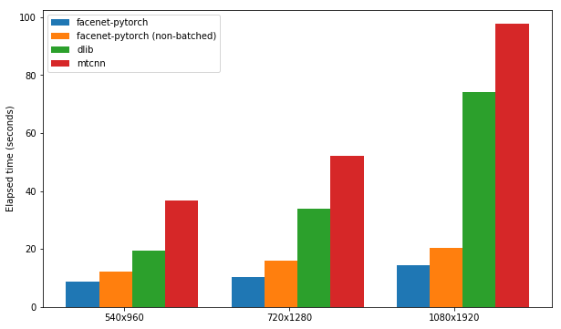

# 使用 Pytorch 进行人脸识别

*Click [here](README.md) to return to the English document*

> 译者注：
>
> 本项目 [facenet-pytorch](https://github.com/timesler/facenet-pytorch) 是一个十分方便的人脸识别库，可以通过 [pip](https://pypi.org/project/facenet-pytorch/) 直接安装。
>
> 库中包含了两个重要功能
>
> - 人脸检测：使用MTCNN算法
> - 人脸识别：使用FaceNet算法
>
> 利用这个库，可以轻松实现人脸检测和人脸向量映射操作。
>
> 为了方便中文开发者研究学习人脸识别相关任务、贡献代码，我将本项目的README文件以及位于 `examples` 里面的几个示例脚本中必要的部分翻译成了中文，以供参考。
>
> 向本项目的所有贡献者致敬。
>
> 英译汉：[远哥挺乐](https://github.com/yuan2001425)
>
> Translator's Note:
>
> This project [facenet-pytorch](https://github.com/timesler/facenet-pytorch) is a very convenient face recognition library that can be installed directly via [pip](https://pypi.org/project/facenet-pytorch/).
>
> The library contains two important features:
>
> - Face detection: using the MTCNN algorithm
> - Face recognition: using the FaceNet algorithm
>
> With this library, one can easily carry out face detection and face vector mapping operations.
>
> In order to facilitate Chinese developers in studying face recognition and contributing code, I have translated the README file of this project and some necessary parts of several example scripts located in the `examples` directory into Chinese.
>
> Salute to all contributors to this project.
>
> Translated from English to Chinese by [远哥挺乐](https://github.com/yuan2001425).

[](https://pepy.tech/project/facenet-pytorch)

[](https://codecov.io/gh/timesler/facenet-pytorch)

|Python | 3.10 | 3.10 3.9 | 3.9 3.8 |
| :---: | :---: | :---: | :---: |
| 测试结果 | [](https://github.com/timesler/facenet-pytorch/actions?query=workflow%3A%22Python+3.10%22+branch%3Amaster) | [](https://github.com/timesler/facenet-pytorch/actions?query=workflow%3A%22Python+3.9%22+branch%3Amaster) | [](https://github.com/timesler/facenet-pytorch/actions?query=workflow%3A%22Python+3.8%22+branch%3Amaster) |

[](https://xscode.com/timesler/facenet-pytorch)

这是 pytorch 中 Inception Resnet (V1) 模型的存储库，在 VGGFace2 和 CASIA-Webface 上进行了预训练。

Pytorch 模型权重使用从 David Sandberg 的 [tensorflow Facenet repo](https://github.com/davidsandberg/facenet) 移植的参数进行初始化。

该存储库中还包含 MTCNN 的高效 pytorch 实现，用于推理之前的人脸检测。这些模型也是经过预训练的。据我们所知，这是最快的 MTCNN 实现。

## 目录

* [目录](#table-of-contents)
* [快速启动](#quick-start)
* [预训练模型](#pretrained-models)
* [示例笔记本](#example-notebooks)
  + [*完整的检测和识别流程*](#complete-detection-and-recognition-pipeline)
  + [*视频流中的人脸跟踪*](#face-tracking-in-video-streams)
  + [*使用新数据微调预训练模型*](#finetuning-pretrained-models-with-new-data)
  + [*facenet-pytorch 中的 MTCNN 指南*](#guide-to-mtcnn-in-facenet-pytorch)
  + [*人脸检测包的性能比较*](#performance-comparison-of-face-detection-packages)
  + [*FastMTCNN 算法*](#the-fastmtcnn-algorithm)
* [使用 docker 运行](#running-with-docker)
* [在您自己的 git 项目中使用此存储库](#use-this-repo-in-your-own-git-project)
* [Tensorflow 到 Pytorch 的参数转换](#conversion-of-parameters-from-tensorflow-to-pytorch)
* [参考资料](#references)

## 快速启动

1. 安装：
   
````bash
# 使用pip安装：
pip install facenet-pytorch

# 或克隆此存储库，删除“-”以允许 python 导入：
git clone https://github.com/timesler/facenet-pytorch.git facenet_pytorch

# 或使用 docker 容器（参见 https://github.com/timesler/docker-jupyter-dl-gpu）：
docker run -it --rm timesler/jupyter-dl-gpu pip install facenet-pytorch && ipython
````

2. 在python中，导入 facenet-pytorch 并实例化模型：
   
````python
from facenet_pytorch import MTCNN, InceptionResnetV1

# 如果需要，使用 MTCNN 创建人脸检测模型：
mtcnn = MTCNN(image_size=<image_size>, margin=<margin>)

# 创建一个 inception resnet（在 eval 模式下）：
resnet = InceptionResnetV1(pretrained='vggface2').eval()
````

3. 处理图像：
   
````python
from PIL import Image

img = Image.open(<image path>)

# 获取裁剪和预白化的图像张量
img_cropped = mtcnn(img, save_path=<optional save path>)

# 计算嵌入（解压缩以添加批量维度）
img_embedding = resnet(img_cropped.unsqueeze(0))

# 或者，如果用于 VGGFace2 分类
resnet.classify = True
img_probs = resnet(img_cropped.unsqueeze(0))
````

有关使用和实现详细信息，请参阅 `help(MTCNN)` 和 `help(InceptionResnetV1)` 。

## 预训练模型

请参阅：[models/inception_resnet_v1.py](models/inception_resnet_v1.py)

以下模型已移植到 pytorch（包含下载 pytorch state_dict 的链接）：

|模型名称|LFW 准确度（如[此处](https://github.com/davidsandberg/facenet)列出）|训练数据集|
| :- | :-: | -: |
|[20180408-102900](https://github.com/timesler/facenet-pytorch/releases/download/v2.2.9/20180408-102900-casia-webface.pt) (111MB)|0.9905|CASIA-Webface|
|[20180402-114759](https://github.com/timesler/facenet-pytorch/releases/download/v2.2.9/20180402-114759-vggface2.pt) (107MB)|0.9965|VGGFace2|

无需手动下载预训练的state_dict；它们会在模型实例化时自动下载，并缓存在 torch 缓存中以供将来使用。要在 pytorch 中使用 Inception Resnet (V1) 模型进行面部识别/识别，请使用：

````python
from facenet_pytorch import InceptionResnetV1

# 对于在 VGGFace2 上预训练的模型
model = InceptionResnetV1(pretrained='vggface2').eval()

# 对于在 CASIA-Webface 上预训练的模型
model = InceptionResnetV1(pretrained='casia-webface').eval()

# 对于具有 100 个类的未经训练的模型
model = InceptionResnetV1(num_classes=100).eval()

# 对于未经训练的 1001 类分类器
model = InceptionResnetV1(classify=True, num_classes=1001).eval()
````

两个预训练模型均在 160x160 像素图像上进行训练，因此如果应用于调整为该形状的图像，则效果最佳。为了获得最佳结果，还应该使用 MTCNN 将图像裁剪到脸部（见下文）。

默认情况下，上述模型将返回 512 维图像嵌入。要启用分类，请将 `classify=True` 传递给模型构造函数，或者您可以随后使用 `model.classify = True` 设置对象属性。对于 VGGFace2，预训练模型将输出长度为 8631 的 logit 向量，对于 CASIA-Webface 则输出长度为 10575 的 logit 向量。

## 示例笔记本

### *完整的检测和识别流程*

通过首先使用 MTCNN 检测人脸，然后使用 Inception Resnet 模型计算嵌入或概率，可以轻松地将人脸识别应用于原始图像。 [examples/infer_cn.ipynb](examples/infer_cn.ipynb) 中的示例代码提供了一个利用数据集、数据加载器和可选 GPU 处理的完整示例流程。

### *视频流中的人脸跟踪*

MTCNN 可用于构建人脸跟踪系统（使用 `MTCNN.detect()` 方法）。完整的面部跟踪示例可以在 [examples/face_tracking_cn.ipynb](examples/face_tracking_cn.ipynb) 中找到。



### *使用新数据微调预训练模型*

在大多数情况下，实现人脸识别的最佳方法是直接使用预训练模型，通过聚类算法或简单的距离度量来确定人脸的身份。但是，如果需要微调（即，如果您想根据模型的输出 logits 选择标识），可以在 [examples/finetune_cn.ipynb](examples/finetune_cn.ipynb) 中找到示例。

### *facenet-pytorch 中的 MTCNN 指南*

本指南演示了 MTCNN 模块的功能。涵盖的主题有：

* 基本用法
* 图像标准化
* 面边距
* 单张图像中的多个面孔
* 批量检测
* 边界框和面部标志
* 保存人脸数据集

请参阅[kaggle 笔记本](https://www.kaggle.com/timesler/guide-to-mtcnn-in-facenet-pytorch)。

### *人脸检测包的性能比较*

本笔记本演示了三个人脸检测包的使用：

1. facenet-pytorch
2. mtcnn
3. dlib

每个包都经过测试，测试其在启用 GPU 支持的情况下检测一组 300 张图像（来自一个视频的所有帧）中的面部的速度。性能基于 Kaggle 的 P100 笔记本内核。结果总结如下。

|套餐|FPS (1080x1920)|FPS (720x1280)|FPS (540x960)|
|---|---|---|---|
|facenet-pytorch|12.97|20.32|25.50|
|facenet-pytorch（非批处理）|9.75|14.81|19.68|
|dlib|3.80|8.39|14.53|
|mtcnn|3.04|5.70|8.23|



请参阅[kaggle 笔记本](https://www.kaggle.com/timesler/comparison-of-face-detection-packages)。

### *FastMTCNN 算法*

该算法演示了如何通过利用相邻帧之间的相似性来实现极其高效的人脸检测，特别是在视频中。

请参阅[kaggle 笔记本](https://www.kaggle.com/timesler/fast-mtcnn- detector-55-fps-at-full-resolution)。

## 使用 docker 运行

该包和任何示例笔记本都可以使用 docker（或 nvidia-docker）运行：

````bash
docker run --rm -p 8888:8888
    -v ./facenet-pytorch:/home/jovyan timesler/jupyter-dl-gpu \
    -v <path to data>:/home/jovyan/data
    pip install facenet-pytorch && jupyter lab 
````

导航到 example/ 目录并运行任何 ipython 笔记本。

有关 docker 容器的详细信息，请参阅 [timesler/jupyter-dl-gpu](https://github.com/timesler/docker-jupyter-dl-gpu)。

## 在您自己的 git 项目中使用此存储库

要在您自己的 git 存储库中使用此代码，我建议首先将此存储库添加为子模块。请注意，当克隆为子模块时，应删除存储库名称中的破折号（“-”），因为它会在导入时破坏 python：

`git submodule add https://github.com/timesler/facenet-pytorch.git facenet_pytorch`

或者，可以使用 pip 将代码安装为包：

`pip install facenet-pytorch`

## Tensorflow 到 Pytorch 的参数转换

请参阅：[models/utils/tensorflow2pytorch.py](models/tensorflow2pytorch.py)

请注意，使用此存储库中的模型不需要此功能，该功能仅依赖于pytorch保存的 `state_dict`。

实例化 pytorch 模型后，每层的权重均从 [davidsandberg/facenet](https://github.com/davidsandberg/facenet) 的预训练Tensorflow模型中的等效层加载。

原始Tensorflow模型和 pytorch 移植模型的输出的等效性已经过测试并且是相同的：

---

`>>> compare_model_outputs(mdl, sess, torch.randn(5, 160, 160, 3).detach())`

````
Passing test data through TF model （通过TF模型传递测试数据）

tensor([[-0.0142,  0.0615,  0.0057,  ...,  0.0497,  0.0375, -0.0838],
        [-0.0139,  0.0611,  0.0054,  ...,  0.0472,  0.0343, -0.0850],
        [-0.0238,  0.0619,  0.0124,  ...,  0.0598,  0.0334, -0.0852],
        [-0.0089,  0.0548,  0.0032,  ...,  0.0506,  0.0337, -0.0881],
        [-0.0173,  0.0630, -0.0042,  ...,  0.0487,  0.0295, -0.0791]])

Passing test data through PT model （通过PT模型传递测试数据）

tensor([[-0.0142,  0.0615,  0.0057,  ...,  0.0497,  0.0375, -0.0838],
        [-0.0139,  0.0611,  0.0054,  ...,  0.0472,  0.0343, -0.0850],
        [-0.0238,  0.0619,  0.0124,  ...,  0.0598,  0.0334, -0.0852],
        [-0.0089,  0.0548,  0.0032,  ...,  0.0506,  0.0337, -0.0881],
        [-0.0173,  0.0630, -0.0042,  ...,  0.0487,  0.0295, -0.0791]],
       grad_fn=<DivBackward0>)

Distance 1.2874517096861382e-06 （距离1.2874517096861382e-06）
````

---

为了重新运行Tensorflow参数到 pytorch 模型的转换，请确保使用子模块克隆此存储库，因为 davidsandberg/facenet 存储库作为子模块包含在内，并且转换需要其中的一部分。

## 参考资料

1. David Sandberg's facenet repo: [https://github.com/davidsandberg/facenet](https://github.com/davidsandberg/facenet)
2. F. Schroff, D. Kalenichenko, J. Philbin. _FaceNet: A Unified Embedding for Face Recognition and Clustering_, arXiv:1503.03832, 2015. [PDF](https://arxiv.org/pdf/1503.03832)

3. Q. Cao, L. Shen, W. Xie, O. M. Parkhi, A. Zisserman. _VGGFace2: A dataset for recognising face across pose and age_, International Conference on Automatic Face and Gesture Recognition, 2018. [PDF](http://www.robots.ox.ac.uk/~vgg/publications/2018/Cao18/cao18.pdf)

4. D. Yi, Z. Lei, S. Liao and S. Z. Li. _CASIAWebface: Learning Face Representation from Scratch_, arXiv:1411.7923, 2014. [PDF](https://arxiv.org/pdf/1411.7923)

5. K. Zhang, Z. Zhang, Z. Li and Y. Qiao. _Joint Face Detection and Alignment Using Multitask Cascaded Convolutional Networks_, IEEE Signal Processing Letters, 2016. [PDF](https://kpzhang93.github.io/MTCNN_face_detection_alignment/paper/spl.pdf)
